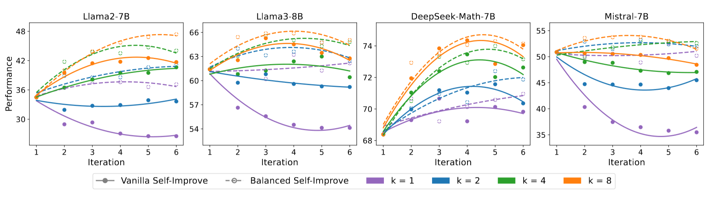
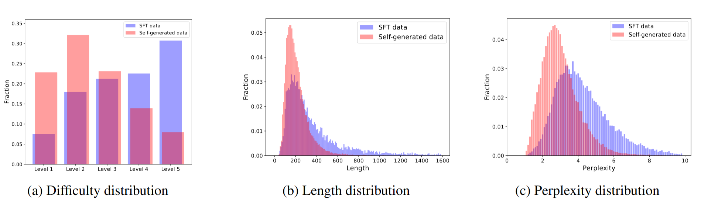

<div align=center><h1>
    🌟Guided Self-Improvement 
</h1></div>


This is the official repository for 📃[Mitigating Tail Narrowing in LLM Self-Improvement via Socratic-Guided Sampling](https://arxiv.org/abs/2411.00750).

## 📖 Introduction

### 1. Performance Bottleneck in Self-Improvement

Self-improvement methods allows LLMs to generate solution and iteratively train on filtered, high-quality rationales. This process proves effective and reduces the reliance on human supervision in LLMs’ reasoning, but the performance soon plateaus. We delve into the self-improvement process, revealing the performance bottlenecks.



### 2. Tail Narrowing

In the self-improvement process, sampling bias leads to the truncation or narrowing of low-probability “tails” in the data distribution, a phenomenon known as **tail narrowing** or **tail cutting**. Analysis of difficulty, response length, and perplexity reveals notable distributional differences between self-generated and original data.



### 3. Guided Self-Improvement

To mitigate tail narrowing, we introduce Guided Self-Improvement (GSI), which uses Socratic-style guidance to help models efficiently tackle challenging queries, reducing exploration effort and computational costs.


## 🌳 Project Structure

```
Guided-Self-Improvement
 ├── README.md                   		
 ├── requirements.txt            		
 ├── scripts    
 ├── data                        		
 │   ├── inference               			# data for sampling processes
 │   ├── MathInstruct.json       			# cot data for finetuning
 │   ├── MathInstruct_pot.json   			# pot data for finetuning
 │   └── test                    			# data for evaluation
 ├── src                         			# training and eval utilities
 ├── train.py                    			# script to finetune the model
 ├── eval.py                     			# script to evaluate
 ├── generate_train_data.py      			# script for data filtering and generation
 ├── inference.py                			# vanilla inference
 ├── inference_answer_driven.py  			# inference with answer-driven
 ├── inference_rationale_driven.py 			# inference with rationale-driven
 ├── inference_teacher_help.py   			# inference with interactive sampling
 ├── inference_state_reset.py    			# inference with state-reset
 └── default_config_deepspeed_ga2.yaml  	# config file for DeepSpeed
```

## 🛠 Environment Setup

```bash
git clone https://github.com/Yiwen-Ding/Guided-Self-Improvement.git
cd Guided-Self-Improvement

conda create -n gsi python=3.9
conda activate gsi

pip install -r requirements.txt
```

## 🧰Self-improvement Pipeline

The self-improvement pipeline enables models to generate multiple reasoning paths, filter out incorrect responses, and fine-tune themselves on correct rationales.

Refer to `./scripts/llama3/cot_train_state_reset.sh` for more details.

### 1. Train

Based on the `accelerate` framework, we train the model on the current iteration’s dataset. For the first iteration, the base model is fine-tuned directly on the original dataset.

### 2. Evaluation

The `vllm` framework supports flexible and efficient inference during evaluation. We evaluate on AQuA, GSM8K, and MATH as held-in datasets, while MathQA, SVAMP, and TheoremQA serve as held-out datasets.

Example command:

```bash
python3 eval.py \
    --model_name_or_path ${model_dir} \
    --results_path "output/eval_data" \
    --temperature 0.0 \
    --dataset_name ${dataset_name} \
    --device_num ${numgpu} \
    --eval_data_file  ${eval_data_file} \
    --max_length ${max_length} \
    --mode ${mode}
```

### 3. Inference

Sampling is conducted on the AQuA, GSM8K, and MATH datasets. We use the  `vllm` framework to inference on the original dataset. By configuring parameters in `generate_response`, such as `answer_driven_hint=True`, `cot_hint=True`, and `state_reset=True`, different inference strategies can be applied.

Example command:

```bash
python_script="inference_state_reset.py" \
                model_path=${model_dir} \
                results_path="output/inference_data" \
                temperature=0.7 \
                dataset_name=${dataset_name} \
                min_correct_num=${min_correct_num} \
                device_num=${numgpu} \
                sample_num=${sample_num} \
                max_resample_num=${max_resample_num} \
                max_length=${max_length} \
                inference_data_file=${inference_data_file} \
                mode=${mode} \
                log_file="output/inference.log" \
                bash ./scripts/_template_inference.sh
```

### 4. Filter the data

To prepare data for the next iteration, we assess the correctness of the sampled data, filtering out errors. See `generate_train_data.py` for details on data generation and filtering.

## 📧 Contact

If you have any questions, please feel free to reach us at [ywding23@m.fudan.edu.cn](mailto:ywding23@m.fudan.edu.cn).

## 🔖 Citation

If you find our work helpful or relevant to your research, please kindly cite our paper:

```
@misc{ding2024mitigatingtailnarrowingllm,
      title={Mitigating Tail Narrowing in LLM Self-Improvement via Socratic-Guided Sampling}, 
      author={Yiwen Ding and Zhiheng Xi and Wei He and Zhuoyuan Li and Yitao Zhai and Xiaowei Shi and Xunliang Cai and Tao Gui and Qi Zhang and Xuanjing Huang},
      year={2024},
      eprint={2411.00750},
      archivePrefix={arXiv},
      primaryClass={cs.CL},
      url={https://arxiv.org/abs/2411.00750}, 
}
```